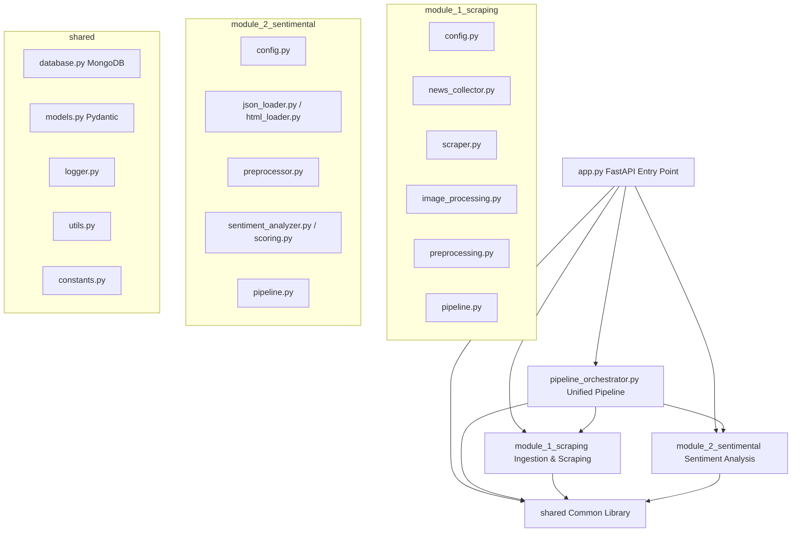

# System Architecture Overview

This project implements a professional, modular news detection and sentiment analysis system. The codebase is divided into two primary domain modules (`module_1_scraping` and `module_2_sentimental`) and a shared library (`shared`).

---

## High-Level Dependency Graph

---

## Component Responsibilities

1. **[app.py](file:///c:/LATEST/news_detection/Model_v2/Main/app.py)**: The FastAPI web server exposing ingestion, cleaning, storage, and unified pipeline endpoints.
2. **[pipeline_orchestrator.py](file:///c:/LATEST/news_detection/Model_v2/Main/pipeline_orchestrator.py)**: Unified pipeline that wires all three data sources (image-processing, news-api, llm-knowledge) into the RoBERTa sentiment model and generates JSON/HTML report files.
3. **`module_1_scraping` (News Collection & Preprocessing)**: Handles external data ingestion via RSS feeds, NewsAPI, GNews, and image upload OCR. It fetches the article web pages or image text, strips HTML boilerplate, and extracts clean, deduplicated paragraphs.
4. **`module_2_sentimental` (RoBERTa Sentiment Analysis)**: Feeds cleaned text into a fine-tuned RoBERTa model to predict sentiment (positive, neutral, negative), emotional intensity, and confidence metrics.
5. **`shared`**: Holds reusable cross-cutting concerns:
   - **`database.py`**: MongoDB client setup, collection index validation, and CRUD operations.
   - **`models.py`**: Pydantic data validation schemas for requests, responses, and storage.
   - **`logger.py`**: Central logging configuration.
   - **`utils.py`**: Helper functions for text normalization, SHA-256 hashing, Jaccard similarity, and URL validations.
   - **`constants.py`**: Global constants used across the application.

---

## Database Design

The system uses **MongoDB** as its persistent storage layer. 

### Collection: `articles`
Each document in the collection represents a processed and cleaned news article.
* **`_id`**: A deterministic hash of the clean URL.
* **`article_id`**: Replicating the URL hash.
* **`title`**: Title of the news article.
* **`url`**: Original web URL of the article.
* **`clean_text`**: Preprocessed and cleaned body text.
* **`description`**: Fallback description text if body content was empty or unparseable.
* **`collected_at`**: Timestamp (UTC) of when the article was ingested.
* **`word_count`**: Total word count of the cleaned body text.
* **`content_hash`**: SHA-256 hash of the cleaned text to detect content duplicates.
* **`url_hash`**: SHA-256 hash of the URL to detect URL duplicates.

Indexes are created on:
- `url` (Unique)
- `content_hash` (Non-unique, for duplication checking)
- `collected_at` (For queries sorting by ingestion date)
