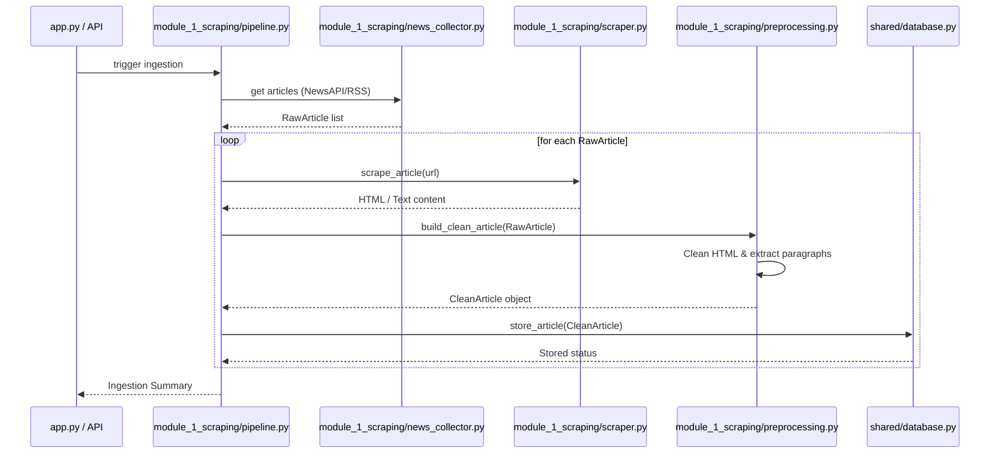

# Module 1 Design: Ingestion & Scraping

`module_1_scraping` is responsible for fetching, cleaning, and validating news article text from the web before storing it in MongoDB.

---

## Technical Flow Diagram

---

## Detailed Components

### 1. Ingestion Sources (`news_collector.py`)
- **NewsAPI / GNews**: Fetches JSON payloads from news search endpoints using a query parameter, pagination, and sorting.
- **RSS Feeds**: Fetches XML feeds, parses XML tags using `feedparser`, and extracts basic titles, links, and publication dates.

### 2. Scraping Waterfall (`scraper.py`)
To robustly scrape articles from arbitrary news domains, `scraper.py` implements a cascading fallback strategy:
1. **Requests**: Performs a fast HTTP GET request using `requests`.
2. **WebBaseLoader / BeautifulSoup**: Parses HTML directly if static and successfully returned.
3. **Playwright (Dynamic Javascript Rendering)**: If static fetching fails or encounters anti-bot protections, it falls back to a headless browser to render the page dynamic elements.

### 3. Text Preprocessing & Cleaning (`preprocessing.py`, `html_cleaner.py`, `content_extractor.py`)
- **HTML Boilerplate Stripping**: Removes scripts, styles, forms, header/footer boilerplate, navigation menus, and empty elements using BeautifulSoup CSS selectors.
- **Unicode Normalization**: Converts ligatures (e.g., `fi` to `fi`), normalizes accents/diacritics, and replaces smart quotes with standard ASCII equivalents.
- **Whitespace Collapsing**: Trims leading/trailing space and collapses multi-line paragraph spacing.
- **Paragraph Filtering**: Separates body text into unique paragraphs. It filters out paragraphs below a minimum word count threshold (e.g., 10 words) to eliminate captions and button labels.
- **Deduplication**:
  - **URL-based**: Uses a deterministic SHA-256 hash of the URL to prevent double scraping of the same web link.
  - **Content-based**: Computes a SHA-256 hash of the cleaned text to detect exact duplicates. Also computes Jaccard similarity coefficients between paragraphs of incoming and stored articles to detect soft/near-duplicate content.
