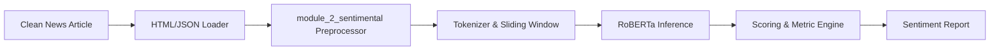

# Module 2 Design: RoBERTa Sentiment Analysis

`module_2_sentimental` is responsible for evaluating the sentiment of collected and cleaned news articles. It uses a fine-tuned Transformer-based RoBERTa model to predict sentiment polarity, emotional intensity, and inference reliability.

---

## Sentiment Pipeline Architecture

---

## Detailed Components

### 1. Fine-tuned RoBERTa Model (`sentiment_analyzer.py`)
- **Base Model**: Uses `cardiffnlp/twitter-roberta-base-sentiment-latest` or equivalent fine-tuned RoBERTa classification model.
- **Inference Pipeline**: Exposes a singleton `SentimentAnalyzer` instance to avoid reloading weights across multiple runs.
- **Device Support**: Dynamically detects GPU (CUDA) availability and falls back to CPU if unavailable.
- **Sliding Window Chunking**: For articles exceeding the model's maximum sequence length (512 tokens), it splits text into overlapping chunks, runs inference on each, and pools the predictions using weighted average logits.

### 2. Metric Scoring Engine (`scoring.py`)
- **Sentiment Polarity**: Classifies text into `positive`, `neutral`, or `negative`.
- **Confidence Scores**: Applies a softmax activation over prediction logits to represent the probability of each class.
- **Emotional Intensity**: Evaluates sentiment shifts between different chunks of the article to determine standard deviation/intensity metrics.
- **Reliability Metric**: Computes a confidence score based on chunk-level consensus and text sequence length constraints.

### 3. Verification & Mocking Strategy (`tests/conftest.py`)
- **Torch and Transformers Mocks**: To allow execution on CI/CD environments and machines without access to Hugging Face or GPUs, a custom mocking mechanism in `conftest.py` intercepts Hugging Face pipeline imports.
- **Mock Model Predictions**: Stubs predictions to return deterministic classification labels and logits based on keyword matching (e.g., matching "disastrous" to negative sentiment).
